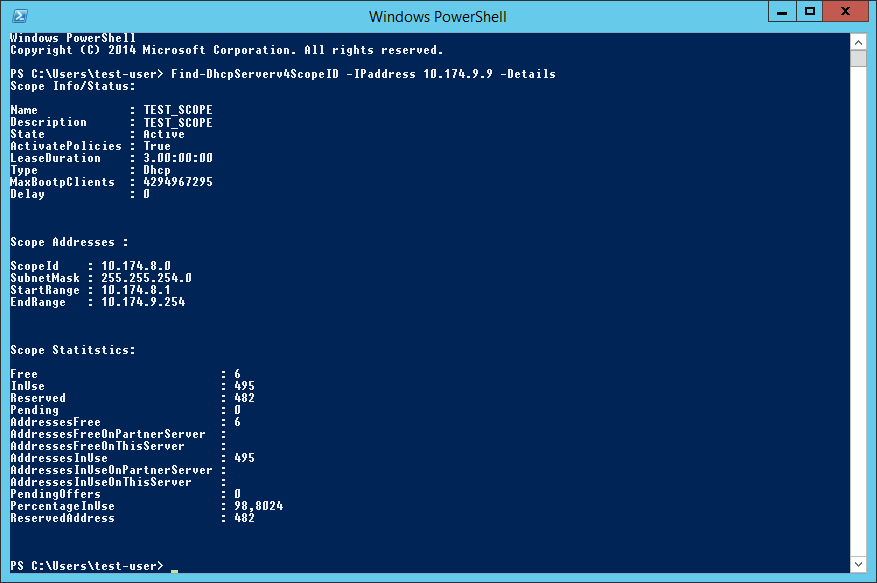

# Find-DhcpServerv4ScopeID
On a DHCP Server, find the ScopeID Which contains a specific ipv4 address

**Description**

Many cmdlets in the DHCP Server PowerShell Module require a ScopeID as parameter to run. This script is a easy way to go trough all scopes on the DHCP server to find the ScopeID that belongs to a spesific IPv4 address.

**Instructions**

Load module:
```powershell
Import-Module .\Find-DhcpServerv4ScopeID
```
DHCP Server PowerShell Module (DHCPServer) needs to be installed.
https://social.technet.microsoft.com/wiki/contents/articles/26694.dhcp-server-powershell-module.aspx

**Functions**

```powershell
Find-DhcpServerv4ScopeID -ComputerName <dhcp server> (optional) -IPaddress <ip> -Details (optional)

```

**Examples**

```powershell
Find-DhcpServerv4ScopeID -IPaddress 10.174.9.9
Find-DhcpServerv4ScopeID -IPaddress 10.174.9.9 -Details
Find-DhcpServerv4ScopeID -ComputerName dhcp-server -IPaddress 10.174.9.9
Find-DhcpServerv4ScopeID -ComputerName dhcp-server -IPaddress 10.174.9.9 -Details
```

**Screenshots**  




**Changelog**  
* 14.08.2019
    * Release
* 28.08.2020
    * Added support for remote DHCP server, use parameter -ComputerName to specify server.

